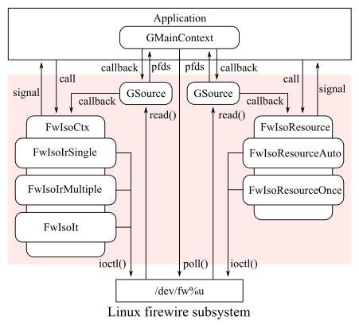

Title: Overview

The library produces some objects derived from [class@GObject.Object] as an abstraction to operate
system resources in Linux FireWire subsystem.

The library operates 1394 OHCI hardware for isochronous communication on IEEE 1394 bus. All
operations are associated with [struct@GLib.Source] retrieved from each object, therefore
applications should be programmed with [struct@GLib.MainContext].

The library supports [GObject Introspection](https://gi.readthedocs.io/en/latest/), thus this
library is available with GObject Introspection bindings of each language such as Python, Ruby and
so on. When using this mechanism, please refer to documents in each language implementation as well.
